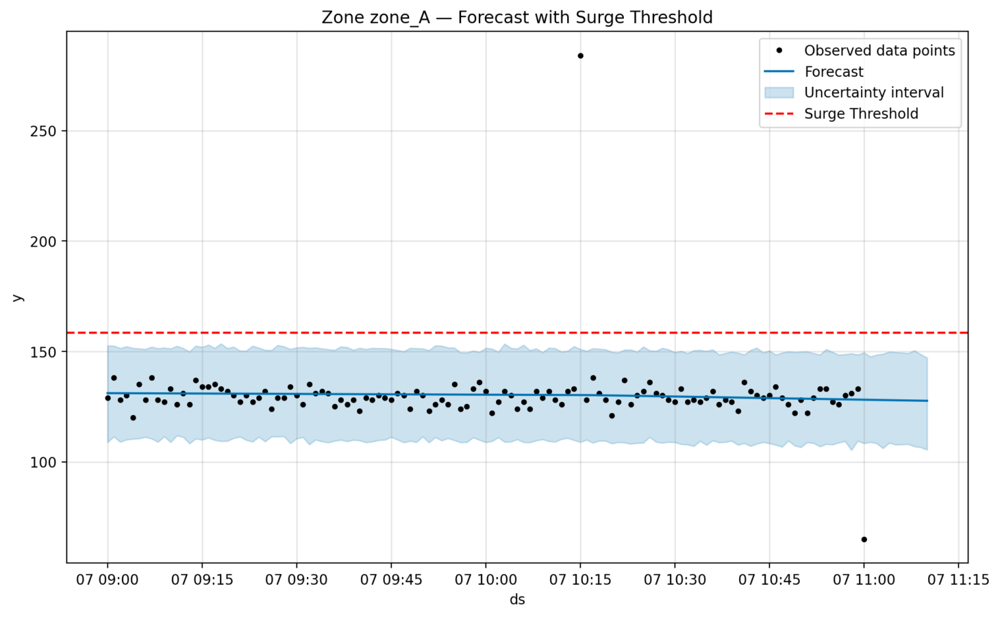
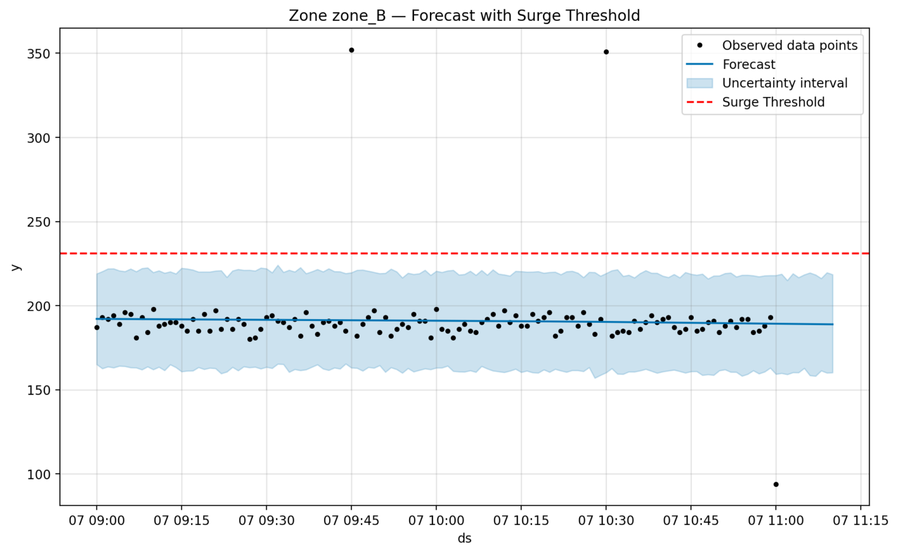
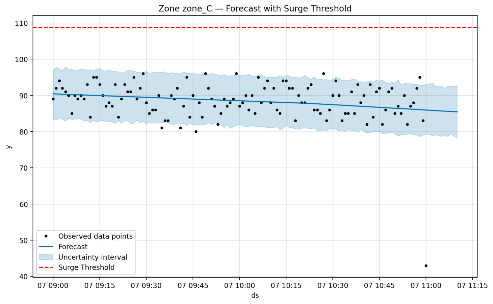

# 🚦 CrowdPulse: Real-Time Crowd Monitoring Using Wi-Fi Probe Logs

📍 **Live App**: [Click to Open Streamlit App](https://crowdpulse-n2kmupxkwfrnchrsshj8fo.streamlit.app/)

---

## 📊 Overview

**CrowdPulse** is a real-time analytics dashboard that forecasts crowd density in public zones by analyzing Wi-Fi probe requests from mobile devices. It applies time-series forecasting using Facebook Prophet and detects abnormal surges with dynamic thresholding.

This project aims to help authorities and event organizers prevent stampedes and overcrowding incidents by providing real-time crowd insights.

---

## 🔧 Features

- 📡 Analyzes Wi-Fi probe logs for crowd estimation
- 📈 Time-series forecasting using Facebook Prophet
- 🚨 Surge detection based on dynamic thresholds
- 🕒 Minute-level resolution with sliding time windows
- 📊 Streamlit-based dashboard with interactive zone selection

---

## 🖼️ Example Forecast Visualizations

<p align="center">
  
  <br>
  <i>Zone A - Forecast with Surge Detection</i>
</p>

<p align="center">
  
  <br>
  <i>Zone B - Forecast with Surge Detection</i>
</p>

<p align="center">
  
  <br>
  <i>Zone C - Forecast with Surge Detection</i>
</p>

> **Note**: Screenshots should be stored inside the `assets/` folder in your GitHub repository.

---

## 📂 File Structure

| File/Folder | Description |
|-------------|-------------|
| `app.py` | Main Streamlit application |
| `wifi_probe_log.csv` | Sample input data containing timestamped zone device counts |
| `requirements.txt` | Python dependencies for the project |
| `assets/` | Folder containing all visual screenshots |
| `README.md` | This documentation file |

---

## ▶️ Run Locally

```bash
# Clone the repository
git clone https://github.com/Aswinthnarayan/CrowdPulse.git
cd CrowdPulse

# Install dependencies
pip install -r requirements.txt

# Run the app
streamlit run app.py

